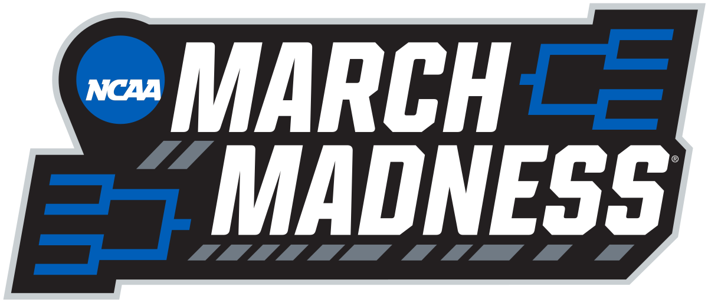
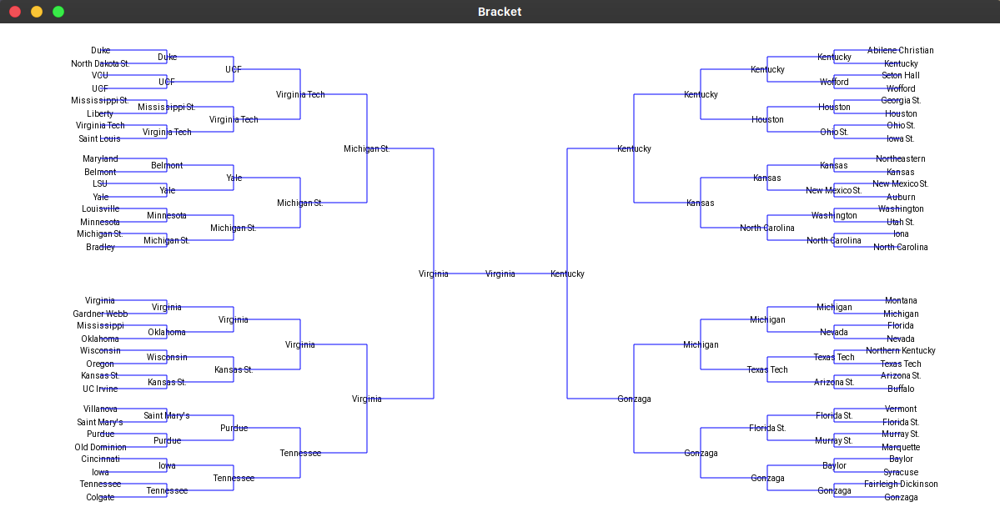

# March Madness Bracket Algorithm

[](https://opensource.org/licenses/MIT)

## Table of Contents

- [About the algorithm](#about-the-algorithm)
- [Getting Started](#getting-started)
  - [Prerequisites](#prerequisites)
  - [Installation](#installation)
  - [Usage](#usage)
- [Examples](#examples)
- [License](#license)
- [Contact](#contact)
- [Acknowledgements](#acknowledgements)

## About the Algorithm



<!-- TODO -->

This algorithm implements a K-Nearest Neighbors Classifier to predict the results of a NCAA March Madness tournament. The model is trained based on each DI game of the 2018-2019 college basketball season.

## Getting Started

To run the algorithm on your machine, follow the below steps

### Prerequisites

- Python3 + pip3
- [Kivy](https://kivy.org/doc/stable/gettingstarted/installation.html)

### Installation

1. Clone the repo

```sh
git clone https://github.com/henryli6/march-madness-bracket.git
```

2. Install python packages

```sh
pip install -r requirements.txt
```

### Usage

<!-- TODO -->

1. Collect and gather data (OPTIONAL: data is included in the respository) <br /> <br />
   **_ Commands should be run with the following blank files: _**

```sh
cd bracket
python get_training_data.py
cd ..
```

NOTE: This will take several minutes <br />

2. Format the team data (This has already been done for the 2016-2017, 2017-2018, and 2018-2019 season data sets) <br />
   For each the year you want to predict:

- Find the right file for the year (e.g. for the 2015-2016 season find **bracket/data/cbb16.csv**)
- Add a new column "REGION"
- For each of the 64 teams in the tournament, find the row and and add their region to the "REGION" column (East, West, Midwest, South)
  <br />

3. Run algorithm and display GUI

```sh
python bracket [tournament year]
```

For example, for the 2017-2018 season, run

```sh
python bracket 18
```

NOTE: If no year is supplied, the algorithm will output the prediction for the 2018-2019 season by default

## Examples

### March Madness 2019 Prediction



<br /> <br />

### March Madness 2018 Prediction


<br /> <br />

### March Madness 2017 Prediction


## License

Distributed under the MIT License. See `LICENSE` for more information. <br/>
[](https://opensource.org/licenses/MIT)

## Contact

Henry Li - [@henry-li-06](https://github.com/henry-li-06) - hl738@cornell.edu

## Acknowledgements

- [Pandas](https://github.com/pandas-dev/pandas)
- [scikit-learn](https://github.com/scikit-learn/scikit-learn)
- [Beautiful Soup](https://www.crummy.com/software/BeautifulSoup/)
- [Kivy](https://kivy.org/#home)
- [Game2D](https://www.cs.cornell.edu/courses/cs1110/2019fa/assignments/a7/api/)
- [introcs](https://pypi.org/project/introcs/)
- [Data for college basketball teams](https://www.kaggle.com/andrewsundberg/college-basketball-dataset)
- [Data for college basketball games](https://www.basketball-reference.com/)
