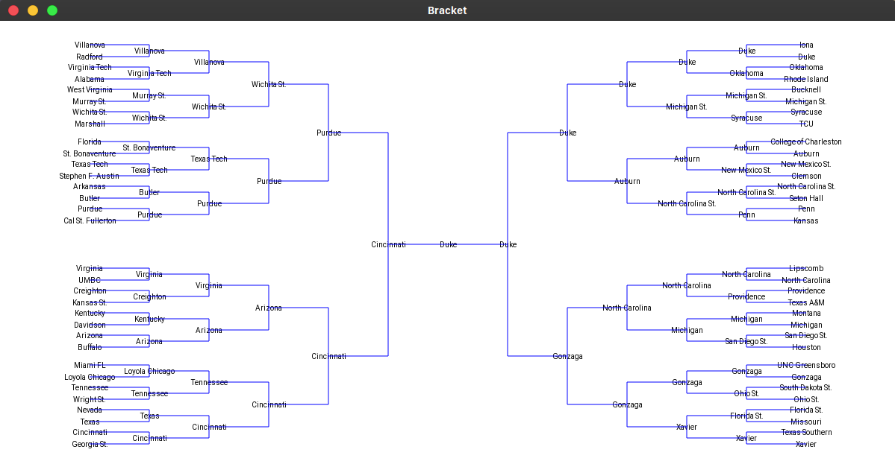

# March Madness Bracket Algorithm
[](https://opensource.org/licenses/MIT)

## Table of Contents

* [About the algorithm](#about-the-algorithm)
* [Getting Started](#getting-started)
  * [Prerequisites](#prerequisites)
  * [Installation](#installation)
  * [Usage](#usage)
* [Examples](#examples)
* [License](#license)
* [Contact](#contact)
* [Acknowledgements](#acknowledgements)


## About the Algorithm


<!-- TODO -->
This algorithm implements a linear SVM to predict the outcome of the 2019 NCAA March Madness tournament.


## Getting Started
To run the algorithm on your machine, follow the  below steps

### Prerequisites 
* Python3 + pip3 
* [Kivy](https://kivy.org/doc/stable/gettingstarted/installation.html)


### Installation
1. Clone the repo
```sh
git clone https://github.com/henryli6/march-madness-bracket.git
```

2. Install python packages 
```sh
pip install -r requirements.txt
```

### Usage 
<!-- TODO -->
1. Collect and gather data (OPTIONAL: data is included in the respository) <br />
*** Commands should be run with the following blank files: ***
    * all_games_19.csv
    * all_games_19_data.csv
    * mm_games_19.csv
    * mm_games_19_data.csv
```sh
cd bracket
python process_data.py
cd ..
```

2. Run algorithm and display GUI
```sh
python bracket
```

## Examples 

### March Madness 2019 Prediction


<br /> <br />

### March Madness 2018 Prediction


<br /> <br />

### March Madness 2017 Prediction


## License 
Distributed under the MIT License. See `LICENSE` for more information. <br/>
[](https://opensource.org/licenses/MIT)


## Contact 
Henry Li - [@henry-li-06](https://github.com/henry-li-06) - hl738@cornell.edu


## Acknowledgements 
* [Pandas](https://github.com/pandas-dev/pandas)
* [scikit-learn](https://github.com/scikit-learn/scikit-learn)
* [Beautiful Soup](https://www.crummy.com/software/BeautifulSoup/)
* [Kivy](https://kivy.org/#home)
* [Game2D](https://www.cs.cornell.edu/courses/cs1110/2019fa/assignments/a7/api/)
* [introcs](https://pypi.org/project/introcs/)
* [Data for college basketball teams](https://www.kaggle.com/andrewsundberg/college-basketball-dataset)
* [Data for college basketball games](https://www.basketball-reference.com/)